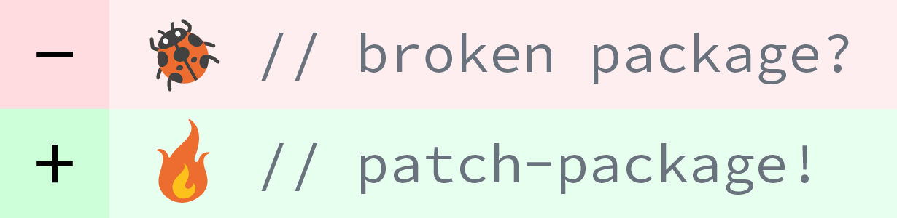

`patch-package` lets app authors instantly make and keep fixes to npm
dependencies. It's a vital band-aid for those of us living on the bleeding edge.

```sh
# fix a bug in one of your dependencies
vim node_modules/some-package/brokenFile.js

# run patch-package to create a .patch file
npx patch-package some-package

# commit the patch file to share the fix with your team
git add patches/some-package+3.14.15.patch
git commit -m "fix brokenFile.js in some-package"
```

Patches created by `patch-package` are automatically and gracefully applied
when you use `npm`(>=5) or `yarn`.

No more waiting around for pull requests to be merged and published.
No more forking repos just to fix that one tiny thing preventing your app from working.

## Set-up

In package.json

```diff
 "scripts": {
+  "postinstall": "patch-package"
 }
```

Then

### npm

    npm i patch-package --save-dev

### yarn

    yarn add --dev patch-package postinstall-postinstall

To understand why yarn needs the `postinstall-postinstall` package see: [Why use postinstall-postinstall](#why-use-postinstall-postinstall-with-yarn)

## Usage

### Making patches

First make changes to the files of a particular package in your node_modules folder, then run

    yarn patch-package package-name

or use npx (included with `npm > 5.2`)

    npx patch-package package-name

where `package-name` matches the name of the package you made changes to.

If this is the first time you've used `patch-package`, it will create a folder called `patches` in
the root dir of your app. Inside will be a file called `package-name+0.44.0.patch` or something,
which is a diff between normal old `package-name` and your fixed version. Commit this to share the fix with your team.

#### Options

* `--use-yarn`

  By default, patch-package checks whether you use npm or yarn based on
  which lockfile you have. If you have both, it uses npm by default.
  Set this option to override that default and always use yarn.

* `--exclude <regexp>`

  Ignore paths matching the regexp when creating patch files.
  Paths are relative to the root dir of the package to be patched.

  Default value: `package\\.json$`

* `--include <regexp>`

  Only consider paths matching the regexp when creating patch files.
  Paths are relative to the root dir of the package to be patched.

  Default value: `.*`

* `--case-sensitive-path-filtering`

  Make regexps used in --include or --exclude filters case-sensitive.

### Updating patches

Use exactly the same process as for making patches in the first place, i.e. make more changes, run patch-package, commit the changes to the patch file.

### Applying patches

Run `patch-package` without arguments to apply all patches in your project.

#### Options

* `--reverse`

  Un-applies all patches.

  Note that this will fail if the patched files have changed since being patched. In that case, you'll probably need to re-install `node_modules`.

  This option was added to help people using CircleCI avoid [an issue around caching and patch file updates](https://github.com/ds300/patch-package/issues/37) but might be useful in other contexts too.

#### Notes

To apply patches individually, you may use `git`:

    git apply --ignore-whitespace patches/package-name+0.44.2.patch

or `patch` in unixy environments:

    patch -p1 -i patches/package-name+0.44.2.patch

## Benefits of patching over forking

* Sometimes forks need extra build steps, e.g. with react-native for Android. Forget that noise.
* Get told in big red letters when the dependency changed and you need to check that your fix is still valid.
* Keep your patches colocated with the code that depends on them.
* Patches can be reviewed as part of your normal review process, forks probably can't

## When to fork instead

* The change is too consequential to be developed in situ.
* The change would be useful to other people as-is.
* You can afford to make a proper PR to upstream.

## Isn't this dangerous?

Nope. The technique is quite robust. Here are some things to keep in mind though:

* It's easy to forget to run `yarn` or `npm` when switching between branches that do and don't have patch files.
* Long lived patches can be costly to maintain if they affect an area of code that is updated regularly and you want to update the package regularly too.
* Big semantic changes can be hard to review. Keep them small and obvious or add plenty of comments.
* Changes can also impact the behaviour of other untouched packages. It's normally obvious when this will happen, and often desired, but be careful nonetheless.

## Why use postinstall-postinstall with Yarn?

Most times when you do a `yarn`, `yarn add`, `yarn remove`, or `yarn install` (which is the same as just `yarn`) Yarn will completely replace the contents of your node_modules with freshly unpackaged modules. patch-package uses the `postinstall` hook to modify these fresh modules, so that they behave well according to your will.

Yarn only runs the `postinstall` hook after `yarn` and `yarn add`, but not after `yarn remove`. The `postinstall-postinstall` package is used to make sure your `postinstall` hook gets executed even after a `yarn remove`.

## License

MIT

[](http://futurice.com/blog/sponsoring-free-time-open-source-activities?utm_source=github&utm_medium=spice&utm_campaign=patch-package)
